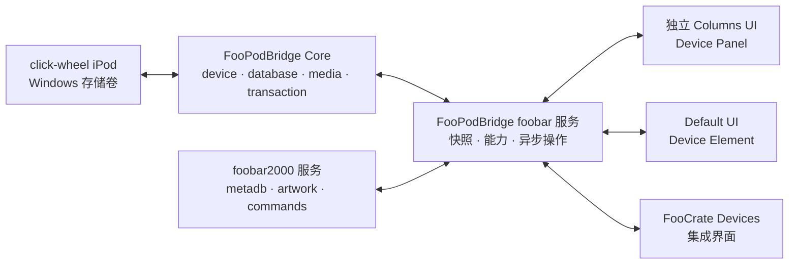

# FooPodBridge 正式架构

- 状态：已批准的架构边界，接口细节等待任务 000 决策完成
- 日期：2026-08-28
- 产品目标：[`PRODUCT_GOAL.md`](PRODUCT_GOAL.md)
- 安全模型：[`SAFETY_MODEL.md`](SAFETY_MODEL.md)
- 历史实现中文蓝图：[`IPOD_MANAGER_IMPLEMENTATION_BLUEPRINT.md`](IPOD_MANAGER_IMPLEMENTATION_BLUEPRINT.md)

## 1. 架构决定

项目采用“混合重建”：

- 建立全新的 Windows x64、现代 C++ 工程和模块边界；
- 从 foo_dop、libgpod 和设备样本理解已经验证的数据格式与算法；
- 不直接移植旧 UI、iOS/Apple Mobile Device 路径、x86 类型假设或来源不明二进制；
- Core、foobar 服务、FooCrate UI、独立 Columns UI 和 Default UI 分层设计。

历史 `foo_dop / iPod manager` 的程序思路不在每个任务中重新概述。跨任务共同流程、空 Library、格式家族、历史行为引用和学习顺序统一维护在 [`IPOD_MANAGER_IMPLEMENTATION_BLUEPRINT.md`](IPOD_MANAGER_IMPLEMENTATION_BLUEPRINT.md)；对应任务只冻结自己采用的章节、差异和验证结果。

## 2. 系统边界



FooPodBridge 和 FooCrate 是两个独立组件：

```text
foo_pod_bridge.dll
├── 独立 Core
├── foobar 服务实现
├── Columns UI Device Panel
└── Default UI Element

foo_crate.dll
└── FooPodBridge 服务消费者
    └── FooCrate 风格 Devices UI
```

两个组件不互相包含 DLL，不复制业务逻辑，独立安装、升级和卸载。

## 3. Core 模块

### 3.1 `device`

职责：

- 接收 Windows 卷到达、移除和盘符变化；
- 识别 iPod 目录结构、设备文件、固件、格式和稳定物理身份；
- 生成设备能力矩阵，而不是只按显示名称猜型号；
- 提供受约束的文件系统访问；
- 监测设备在长操作中是否仍是同一台、同一次挂载；
- 在操作完成、失败或安全取消后 Flush 并释放全部设备句柄；不提供系统弹出，由用户使用 Windows 资源管理器。

它依赖 Windows 存储/卷 API 和抽象文件系统接口，但不依赖 foobar2000 或 UI。

### 3.2 `database`

职责：

- 解析和序列化传统 `iTunesDB`、播放列表、曲目与相关设备数据库；
- 以数据库家族建立可扩展格式 profile：传统未签名 `iTunesDB`、6G/hash58 签名 `iTunesDB`，并把 Shuffle 与 Nano 5+ 新数据库路径隔离；
- 型号能力和验证等级独立于格式 profile；同一 Reader/Writer 可以被多个型号复用，但不能因此自动继承实机写入结论；
- 保留当前实现尚不理解但设备需要的记录和字段，防止无意删除；
- 管理 master playlist、普通 playlist 和 Smart Playlist 引用；
- 处理 Classic、Nano 3/4 等签名传统数据库候选设备所需的 hash58；
- 对序列化结果执行内存中往返解析和结构一致性验证。

Reader、领域模型、Writer 和 Validator 分开。UI 不接触原始数据库记录。

### 3.3 `media`

职责：

- 接收与 foobar 无关的规范化导入描述；
- 检查 codec、container、profile、时长、大小和目标设备能力；
- 映射标题、艺术家、专辑、排序、碟号、曲号等元数据；
- 读取原始 Album Artist/Artist/Compilation，并按批准规则合并导入批次、设备现有记录和无歧义的 foobar 曲库证据推断 Compilation；
- 计算或转换 SoundCheck；
- 为 Classic 提取准确 gapless 信息；
- 准备封面与 Audiobook 属性；
- 生成导入计划所需的目标记录，不执行设备提交。

foobar 适配层负责把 `metadb_handle`、标题格式结果和 artwork 服务结果转换为通用输入；Core 不保存 foobar SDK 对象。

### 3.4 `transaction`

职责：

- 把导入、删除、playlist 和 Smart Playlist 编辑转成不可变操作计划；
- 预检设备身份、能力、空间、格式、重复项和冲突；
- 串行化同一设备的写入，禁止 UI 并发修改；
- 备份关键数据库，管理批次暂存和恢复记录；
- 以 [`SAFETY_MODEL.md`](SAFETY_MODEL.md) 的顺序提交音频与数据库；
- 报告逐项和整体结果，支持在安全边界取消；
- 下次连接时识别本项目遗留的临时文件并执行已批准清理策略。

事务模块是唯一允许改变设备文件的模块。

## 4. foobar2000 适配与服务

### 4.1 适配职责

foobar 适配层负责：

- 将 foobar 曲目选择、拖放数据和播放列表内容转换为 Core 输入；
- 通过正式 metadb、file info 和 artwork 服务取得源数据；
- 把后台结果安全切回 foobar/UI 主线程；
- 管理组件卸载、服务对象生命周期和异步取消；
- 注册 Preferences、主菜单/上下文命令和稳定 GUID；
- 把设备曲目路径转换成 foobar 可播放的 metadb handles，但不把设备 playlist 冒充 foobar playlist。

### 4.2 服务语义

稳定服务至少发布以下概念，具体 C++ 签名在服务合同任务中冻结：

- `DeviceSnapshot`：某一时刻不可变的设备身份、容量、能力、Library 与状态；
- `CapabilityMatrix`：该设备允许哪些格式、数据库、封面、gapless、Smart Playlist 和写入行为；
- `OperationRequest`：UI 表达的用户意图；
- `OperationPlan`：预检后的明确文件、空间、冲突、警告和预计结果；
- `OperationHandle`：异步执行、进度、取消请求和最终结果；
- `DeviceEventSubscription`：设备到达、移除、状态和 Library 代次变化通知。

服务规则：

- UI 取得快照后不能修改其内容；
- 请求携带设备稳定身份和快照代次，提交前再次核对；
- 服务只接受用户意图，不暴露“写某个数据库偏移”之类危险接口；
- 所有写操作异步执行，进度与结果具有稳定操作 ID；
- 服务版本不兼容时消费者明确隐藏写入并提示，不猜测 ABI。

## 5. UI 适配器

### 5.1 FooCrate

FooCrate 是优先设计和验收的体验：

- 通过 FooPodBridge 服务发现设备；
- 在既有 Playlist Browser 下方显示独立 Devices namespace；
- 使用 FooCrate 已有主题、Direct2D/DirectWrite、DPI、拖放和状态体系；
- 把设备 Library 显示在专门 Device Workspace 中，不塞入 foobar Playlist Manager；
- 服务缺失时不显示 Devices，其他 FooCrate 功能不受影响。

FooCrate 代码不包含设备数据库结构、hash58、文件命名或事务规则。

### 5.2 独立 Columns UI Device Panel

- 面向不使用 FooCrate 的 Columns UI 用户；
- 提供完整能力和错误反馈；
- 外观遵循 Columns UI 主题与布局宿主，不复制整个 FooCrate 外壳；
- 与 FooCrate 共用服务行为，不维护第二套写入逻辑。

### 5.3 Default UI Element

- 使用 Default UI 原生、简洁的外观；
- 暴露经用户批准的基础设备浏览和手动管理入口；
- 不为了视觉一致性复制 FooCrate 自绘系统；
- 即使界面较简化，危险操作、事务和错误行为不能降级。

详细视觉稿按用户决定推迟到对应 UI 任务，当前只冻结拓扑和职责。

## 6. 数据流

### 6.1 读取设备

```text
Windows volume event
→ device 识别目录、设备身份和能力
→ database 读取 Library/playlist
→ 生成不可变 DeviceSnapshot
→ 服务发布新代次
→ 各 UI 只更新受影响状态
```

### 6.2 导入批次

```text
UI 拖入或发送曲目
→ foobar 适配层取得 metadb、文件信息和封面
→ media 规范化并检查格式/Compilation/SoundCheck/gapless/Audiobook
→ transaction 生成 OperationPlan
→ UI 展示空间、重复、警告和目标
→ 用户确认或直接执行无争议计划
→ 音频批次写入一次
→ database 在内存中生成并验证一次
→ transaction 备份、设备写入、读回、提交
→ 发布新 DeviceSnapshot 和最终结果
```

### 6.3 删除

```text
UI 明确选择“从 playlist 移除”或“从设备删除”
→ 服务冻结设备/曲目稳定 ID
→ transaction 预检引用关系
→ 先提交不再引用目标的数据库
→ 再删除无引用音频
→ 删除失败时报告孤立文件，但保持数据库可用
```

## 7. 并发、线程与生命周期

- 每台设备最多一个写事务；首版全进程一次只执行一个写事务，其他设备的写请求排队或明确拒绝，实机测试后再评估是否需要放宽。
- 设备读取、媒体分析、复制、数据库构建和验证不阻塞 UI 线程。
- UI 订阅持有可取消令牌；窗口销毁、组件卸载或服务消失后，晚到回调只被丢弃。
- 设备移除立即使当前快照失效；事务按安全模型进入 Interrupted/RecoveryRequired，而不是继续用旧盘符。
- 进度只报告已经完成的真实阶段，不用定时器伪造百分比。

## 8. 错误模型

错误面向用户分为：

- Unsupported：设备、格式或规则确实不支持；
- PreflightBlocked：空间、身份、权限、重复或冲突阻止执行；
- ItemWarning：单曲 gapless、封面或非关键元数据失败，批次可以继续；
- TransactionFailed：批次未提交，旧数据库仍是有效目标；
- RecoveryRequired：提交窗口中断，需要按恢复记录处理；
- DeviceRemoved：设备在操作中消失；
- ServiceUnavailable：FooPodBridge/FooCrate 服务版本或生命周期不可用。

UI 显示影响、当前数据状态和恢复动作；技术日志保留错误码与阶段，但不暴露隐私路径或整份数据库。

## 9. 可测试性

- Core 对文件系统、设备身份、时间和故障点使用可替换接口；
- 数据库使用脱敏 golden fixture 进行读取、未知字段保留、修改和往返测试；
- 事务测试在临时目录注入磁盘满、拒绝访问、短写、Flush 失败、重命名失败和设备代次变化；
- 服务合同测试不启动真实 UI；
- FooCrate、Columns UI 和 Default UI 分别验证同一状态与命令结果；
- 实机只验证自动测试无法证明的固件接受、hash58、SoundCheck、gapless、封面、Smart Playlist 和重启后行为。

## 10. 依赖方向

允许：

```text
UI → foobar service contract → Core public API
transaction → device/database/media public API
foobar adapter → Core public API + foobar SDK
```

禁止：

```text
Core → foobar SDK
Core → FooCrate
UI → iTunesDB raw records
FooCrate → FooPodBridge private headers
Default UI → Columns UI
database → UI callbacks
```
